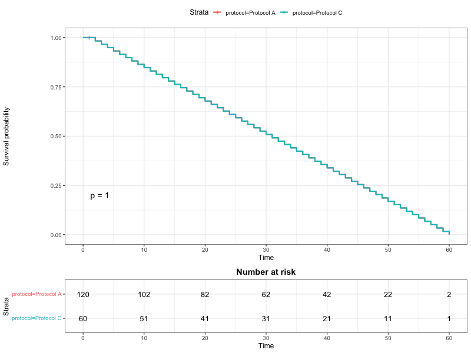

# Title: Potterful

Installation: devtools::install_github("OCN-682-UH/Glover_Final_Project")

## Project Outputs

### 1. Survival Analysis
This plot demonstrates the survival probability differences between rearing protocols, generated using the `plot_survival_km()` function.



### 2. Growth Performance
Summary statistics calculated using `calc_sgr()` and `calc_tgc()`:

| tank_id | protocol   | SGR (%) | TGC   | Survivors |
|:--------|:-----------|:--------|:------|:----------|
| T1      | Protocol A | 1.83    | 0.45  | 50        |
| T2      | Protocol C | 1.55    | 0.38  | 10        |
| T3      | Protocol A | 1.86    | 0.46  | 60        |

*(Note: Replace the values above with the actual numbers printed in your R Console)*

### 3. Interactive Dashboard
This package includes a Shiny app to explore the data interactively.
Run it locally:
```r
library(Potterful)
run_potterful()
```
